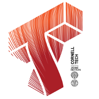

# DreamTeam

Product Studio company challenge at Cornell Tech, Fall 2017
* How might we make buying ancillary products more personalized for online customers?

Product Narrative:
We are building an online web-app to increase BMW’s protection product engagement and to spread awareness surrounding BMW care.

Roster:
- name: Andreas Thoma-Baker
  email: at832@cornell.edu
  [Andreas](Project/images/andreas.png)

Roster:
- name: Yuxue Mei
  email: ym434@cornell.edu
  [Michelle](Project/images/andreas.png)

Roster:
- name: Alex Kharchistov
  email: ok75@cornell.edu
  [Alex](Project/images/andreas.png)

Roster:
- name: Haochen Jia 
  email: hj427@cornell.edu
  [Jacob](Project/images/andreas.png)

Roster: 
- name: Joungyeun Lee 
  email: leej970@newschool.edu
  [Joungyeun](Project/images/andreas.png)
  

  
## Development Process: 
The plan is to have milestones achieved on bi-weekly basis. This doesn't limit us to meeting on specific days during the week as it should be flexible given our busy schedule. However, it would be easy for us to agree upon a specific date prior to the week we have specific milestone due.

## Development Timeline:
* 09/19 - 10/01
  Research, gather data, decide on features and UI design
  (Sprint 2)
* 10/13
  Analyze data and backend strategies for building the recommendation system
* 10/27
  Have the recommendation system ready for initial test
* 11/10
  Combine and testing of the starting product
* 11/17
  Final product presentation
  (Sprint 3)
* 11/28
  Final presentation
* 12/14
  Open studio
